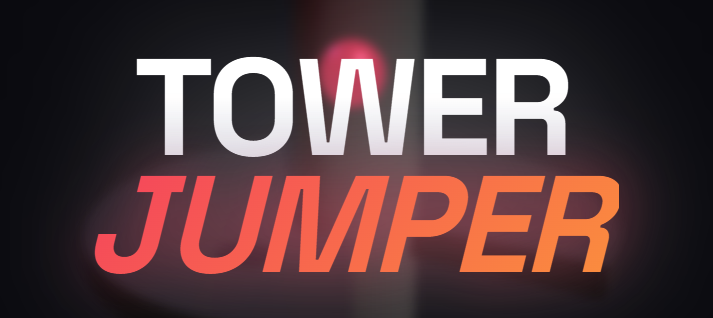

# TowerJumper

A fast-paced, addictive 3D arcade game where you guide a bouncing ball through a helix tower labyrinth. Master the physics, avoid the red zones, and smash through platforms to reach the bottom!



## 🎮 How to Play

The goal is simple: get the bouncing ball to the bottom of the tower.

*   **Rotate the Tower:** Drag horizontally to rotate the tower and align gaps with the ball.
*   **Avoid Danger:** Do not touch the **Red** platforms or it's Game Over!
*   **Smash combos:** Fall through 3 or more platforms without touching them to charge up a fireball and smash through the next landing!

## 🕹️ Controls

| Platform | Action |
|----------|--------|
| **Desktop** | Click & Drag Mouse or Use Left/Right Arrow Keys |
| **Mobile** | Touch & slide finger horizontally |

## ✨ Features

*   **⚡ Real-time Physics:** Powered by `cannon-es` for satisfying bounces and gravity.
*   **🎨 Dynamic Themes:** Beautiful procedural color schemes that change every level.
*   **📱 Responsive Design:** smooth gameplay on both Desktop and Mobile devices.
*   **🔊 Immersive Audio:** Custom sound effects for bounces, explosions, and combos.
*   **💥 Power-up System:** Build streaks to become invincible and shatter platforms.
*   **⚙️ Configurable Gameplay:** detailed settings for sensitivity and performance.

## 🛠️ Built With

*   [Three.js](https://threejs.org/) - 3D Rendering Engine
*   [Cannon-es](https://github.com/pmndrs/cannon-es) - 3D Physics Engine
*   [Vite](https://vitejs.dev/) - Next Generation Frontend Tooling

## 🚀 Installation & Setup

1.  **Clone the repository**
    ```bash
    git clone https://github.com/yourusername/TowerJumper.git
    cd TowerJumper
    ```

2.  **Install Dependencies**
    ```bash
    npm install
    ```

3.  **Run Development Server**
    ```bash
    npm run dev
    ```

4.  **Build for Production**
    ```bash
    npm run build
    ```

## 👨‍💻 Author

**Sekhon**  
*Developer of TowerJumper*

---
*Enjoy the jump!*
